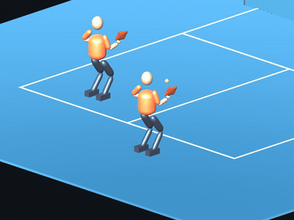
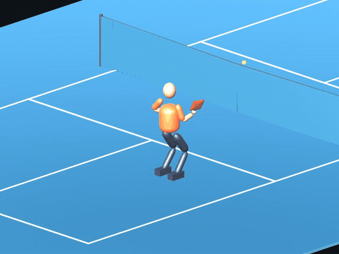
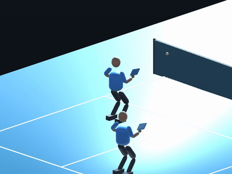
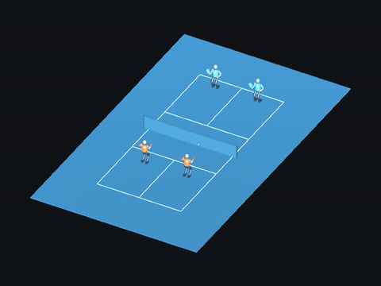

# Picklebot

**Teaching a simulated player to move, swing and play pickleball.**

Unity · ML-Agents PPO · constrained body control · independent players with shared weights

| Serve | Return after a bounce |
|:---:|:---:|
|  |  |
| Volley | Two-player practice |
|  |  |

Recorded policy actions from the same historical checkpoint. Paired play is an unfinished baseline. [Clips & replay details](docs/DEMO.md)

## Where it stands

| Working | Still learning |
|---|---|
| Fixed-ball serves and central returns | Wide, deep and shallow movement returns |
| Bounded shoulder, elbow, wrist and body controls | Reliable transitions between shots |
| Parallel drills, paired practice and self-play infrastructure | Sustained learned 2v2 play |

**Latest evaluation, 24M-step executor:** 224/224 narrow rally returns, 260/384 wide rally returns, 352/448 randomized rally returns, and 64/64 serves in the wide battery (target A). These are repeated development tests, not full-game acceptance. [Checkpoint results and downloads](docs/TRAINED_CHECKPOINT.md)

## Try it

Open the project in **Unity 6000.5.5f1**. Trained ONNX models and preview scenes are included.

[Unity demo guide](docs/DEMO.md) · [Training setup](docs/TRAINING_SETUP.md) · [Current checkpoint](docs/CURRENT_STATE.md)

## Next

**Strategy → execution:** the goal-conditioned executor is trained; the learned strategy policy and reliable 2v2 coordination remain future work. [Design](docs/HIERARCHICAL_CONTROL.md)

Physics and body motion remain simplified. This is a learning prototype; match-level acceptance is still open.

[Technical archive](docs/archive/README-before-2026-09-11.md) · [Architecture history](docs/ARCHITECTURE.md) · [Decision log](docs/DECISIONS.md)
