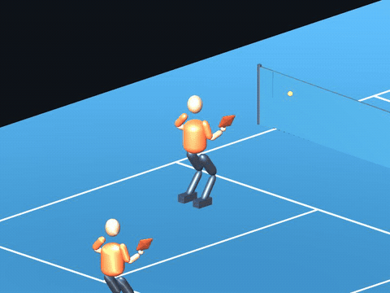

# Watch the player

The README clips are actual Unity recordings, replayed at their recorded 20 fps. They are selected examples, not a success-rate benchmark.

| Clip | Checkpoint | What it shows |
|---|---:|---|
| [Serve](media/serve.gif) | 3,818,028 | Learned paddle contact with a ball held still until contact |
| [Bounced return](media/return.gif) | 3,818,028 | A rally feed returned after its bounce |
| [Volley](media/volley.gif) | 3,818,028 | An airborne rally return |
| [Paired practice](media/paired.gif) | 3,818,028 | Two players using independent observations and actions; an unfinished coordination baseline |
| [Movement miss](media/movement-miss.gif) | 8,415,374 | A failed 20 cm lateral feed variation; variation is feed placement, not a joint limit |

Exact seeds, outcomes, model identities and frame hashes: [media manifest](media/manifest.json). The historic footage predates the latest comparison; use the [evaluation report](research/critic-key-comparison.md) for current measurements.

## Open the Unity previews

1. Open this repository with Unity **6000.5.5f1** and let packages import.
2. Open `Assets/Picklebot/Scenes/ArticulatedFocusedLateralPreview01.unity` for a historical learned-return preview, or `Assets/Picklebot/Scenes/PlayerControlLab.unity` to inspect the body controls.
3. Press **Play**. For the learned drill, open **Window → Picklebot → Training Monitor** and use its court/detail view in the **Scene** tab.

Preview scenes contain their own historical model assignments. Their results are not the latest comparison and their stored source labels are historical. Headless build scenes require a worker manifest; they are not click-to-play demos.

The raw frame-by-frame museums and full training logs remain in the local research archive. These compact recordings are included directly in Git so the README can display them without a separate hosting service.
